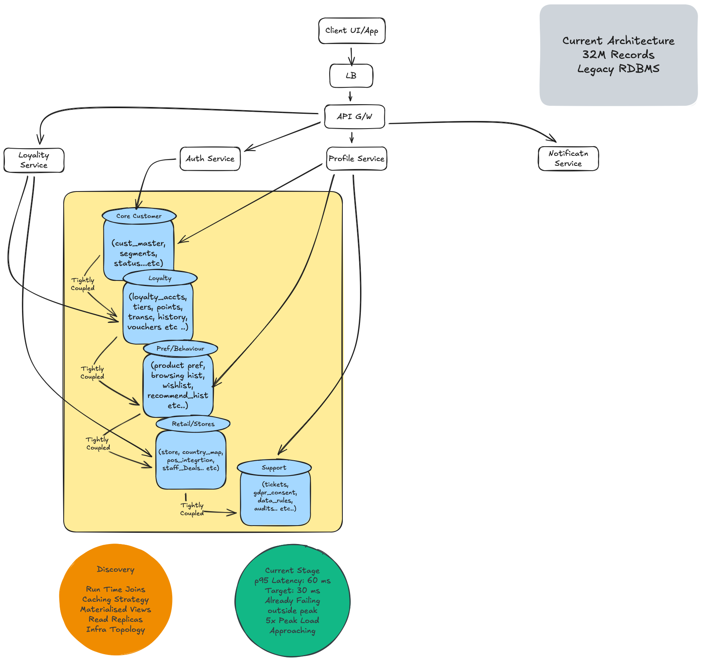

# Architecture

>**Document:** 02-architecture.md .  
**Status:** ```IN REVIEW``` .  
**Last Updated:** 20 April 2026

---

## Current State

The existing platform is built on a legacy RDBMS with 45+ normalised tables spread across five functional domains. Every customer-facing operation
requires runtime JOINs across multiple table groups.

The result is a system already failing its own performance targets on a normal traffic day — before peak season has started.




**Key Observations:**

| Dimension | Current State |
|-----------|--------------|
| p95 Latency | 60ms against a 30ms target — already breached |
| Peak Load | 5X on busiest days — not yet stress tested |
| Table Coupling | Five domains tightly coupled with no clean boundaries |
| Read Path | Runtime JOIN vs materialised views vs stored procedures — TBC in Discovery |
| Infrastructure Topology | TBC in Discovery |
| Table Distribution | 45+ tables across five domains — exact count per domain confirmed in Discovery |

---

## Target State

The target architecture addresses three problems simultaneously — latency, scalability, and GDPR compliance — without stopping the business
while we migrate.

This is a transition state diagram — not the final end state. The Legacy RDBMS remains live and hot throughout the 6 month window. Full decommission is a post Month 6 activity.


---


## Collections Design

Five legacy domains collapse into three MongoDB collections:

| Collection | Absorbs | Document Design |
|------------|---------|-----------------|
| `customer_profiles` | Core Customer, Preferences and Behaviour, Retail and Store domains | One document per customer — all profile data in a single fetch — variable attributes by design — exact domain table mapping confirmed in Discovery |
| `loyalty_accounts` | Loyalty domain | One document per loyalty account — points balance, tier, and history embedded — append-only transactions sub-document — Loyalty Points API reads from here |
| `compliance_records` | Support and Compliance domain | One document per customer — GDPR consent, audit trail, privacy requests — EU records pinned to EU region — immutable audit log by design |

---

## Sharding Strategy

**Shard Key:** `{ customer_id: 1 }`

| Decision | Rationale |
|----------|-----------|
| Why customer_id | High cardinality across 32M records — even distribution — all customer operations include customer_id — avoids scatter-gather on primary read path |
| Shard count at launch | To be finalised in Discovery — starting point is 3 shards — each shard runs as a replica set (Primary + 2 Secondaries) |
| Inactive customers (20M) | Atlas Online Archive — moves inactive records to low-cost storage — reduces hot dataset from 32M to 12M — directly improves shard utilisation |

---

## GDPR Architecture

**Scope:** EU customers (~15% of 32M = ~4.8M records)

---

## Strangler Fig — Traffic Shifting Strategy

The Strangler Fig pattern means the existing API layer is retained throughout the migration.
No application rewrite is required.
Legacy services continue serving traffic while new Atlas-backed paths are introduced alongside them and progressively take over.

### How Traffic Shifting Is Controlled

Traffic shifting is controlled exclusively at the API Gateway layer using weighted routing rules.
This is a configuration change only — no application code modification required.
This directly respects the limited refactoring budget constraint called out in the brief.

The API Gateway already exists in the current architecture. We are extending its capability — not introducing new infrastructure.

### Traffic Shifting Sequence

| Mechanism | When | How | Rollback |
|-----------|------|-----|----------|
| Shadow Mode | Month 3 — validation | Reads from both RDBMS and Atlas simultaneously — serves legacy result to client — compares Atlas result in background — logs discrepancies — zero customer risk — no code change required | Turn off Atlas comparison — zero impact |
| API Gateway Weighted Routing | Month 4 — 50% shift | Gateway routes 50% of traffic to Atlas-backed endpoint — configuration change only — no application code change — non-EU customers shifted first — EU customers shifted after GDPR audit complete | Return gateway weight to 100% legacy — seconds |
| API Gateway Full Cutover | Month 5 — 100% shift | Weight moved to 100% Atlas — legacy endpoint retained but receives 0% traffic — decommissioned after 2 week stable window | Return gateway weight to 100% legacy — seconds |


### API Gateway Capability — Discovery Dependency

```
Weighted routing capability of the existing API Gateway confirmed in Month 1 Discovery.

If existing gateway does not support weighted routing, two fallback options:

  Option A: Introduce a lightweight proxy layer
            (nginx, Envoy) — minimal infrastructure
            No application code change

  Option B: Simple routing flag in service layer
            Lightweight if/else — minimal code change
            Within limited refactoring budget

Either way: a Discovery finding — not an assumption carried into build.
```

---

## API Layer Optimisations

No explicit cache layer is introduced.
The 30ms target is achieved through four driver-level optimisations at the API layer.
These are configuration changes — not infrastructure additions.

| Optimisation | What It Does | Applies To |
|--------------|-------------|------------|
| Read Preference Routing | Routes reads to secondary replicas — primary handles writes only — distributes read load across replica set | `customer_profiles`, `compliance_records` |
| Primary Reads for Balance | Loyalty balance always reads from primary node — guarantees real-time accuracy — no replication lag on business-critical data | `loyalty_accounts` |
| Connection Pooling | Persistent connection pool at driver level — eliminates per-request connection overhead of 5-20ms — mandatory for hitting 30ms target | All services |
| Query Projections | Returns only fields required by each API endpoint — reduces document payload and serialisation overhead — confirmed per endpoint during build | All services |

---

## Latency Target — How We Get to 30ms

| Component | Latency Budget |
|-----------|----------------|
| Document fetch (single collection read) | In Progress    |
| Network latency (with compression) | In Progress    |
| Application serialisation (with projections) | In Progress    |
| Atlas overhead | In Progress    |
| **Total target p95** | **< 30ms**     |

**Validated at:**

| Milestone | When | Load Level |
|-----------|------|------------|
| Baseline on representative dataset | Month 2 | 1X normal |
| Shadow mode validation | Month 3 | 1X normal |
| Weighted routing at 50% traffic | Month 4 | 2X average peak |
| 5X synthetic load simulation | Month 5 | 5X busiest day |

**At 5X peak:** Horizontal sharding distributes read load across shards — no single node becomes the bottleneck — each shard handles a fraction
of the 32M record dataset.

---

## Technology Selection Rationale

| Dimension | DynamoDB                                                       | MongoDB Atlas |
|-----------|----------------------------------------------------------------|-------------|
| Access pattern flexibility | Rigid — must be known upfront                                  | Flexible — rich querying without redesign |
| Schema evolution | Painful — table redesign on every pivot                        | Natural — add a field, ship in one sprint |
| Vendor lock-in | Highest risk — no exit path without rewrite                    | Lower risk — multi-cloud, open data model |
| GDPR enforcement | Application layer only                                         | Storage layer via Atlas Global Clusters |
| Migration complexity | Single-table design from 45+ tables exceeds refactoring budget | Document model maps naturally — Change Streams enable CDC without application changes |
| Strangler Fig compatibility | Requires new service version — application change              | Sits behind existing services via API Gateway routing — no application changes |
| Budget constraint alignment | Single-table redesign requires significant refactoring         | Document model + gateway routing = minimal refactoring |
| **Verdict** | Not Ideal                                                      | Selected |

---

## Open Architecture Decisions

These require Discovery findings before finalising.
None of these are blockers to beginning Discovery — they are outputs of it.

| # | Decision | Blocks | Owner | Required By |
|---|----------|--------|-------|-------------|
| 1 | Current read path confirmed (JOINs vs materialised views vs stored procedures) | Migration complexity estimate | Discovery | End of Month 1 |
| 2 | Infrastructure topology confirmed | Baseline comparison | Discovery | End of Month 1 |
| 3 | Table distribution across domains confirmed | Collection design finalised | Discovery | End of Month 1 |
| 4 | Shard count finalised | Capacity planning | Discovery | End of Month 1 |
| 5 | Atlas tier selection | Cost modelling | Discovery | End of Month 1 |
| 6 | EU zone selection confirmed with DPO | GDPR architecture sign-off | DPO | End of Month 1 |
| 7 | API Gateway weighted routing capability confirmed | Traffic shifting mechanism | Discovery | End of Month 1 |
| 8 | CDC tooling confirmed (Debezium vs Atlas Triggers vs native CDC) | Transition layer build | Discovery | End of Month 1 |
| 9 | Loyalty balance sign-off authority named | Month 5 loyalty cutover gate | Customer Executive Sponsor | End of Month 1 |
| 10 | 5X load testing data strategy confirmed with DPO | Month 5 load simulation | DPO + VP Ops | End of Month 2 |

---

