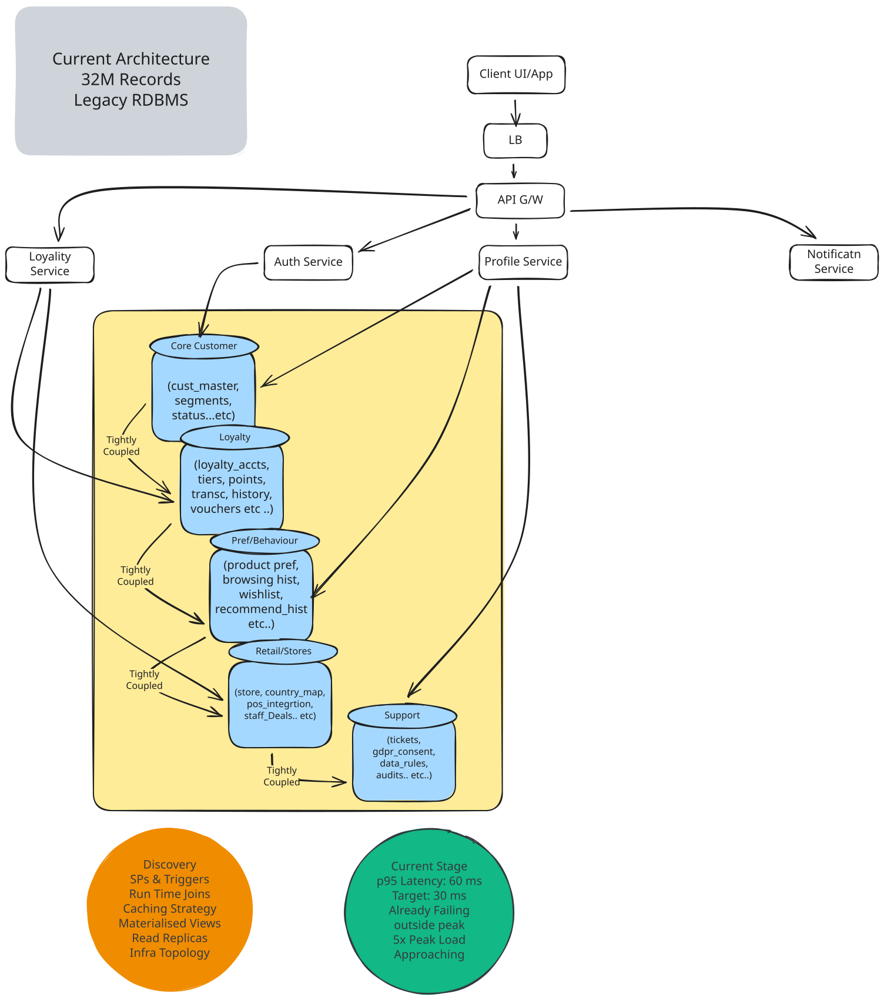
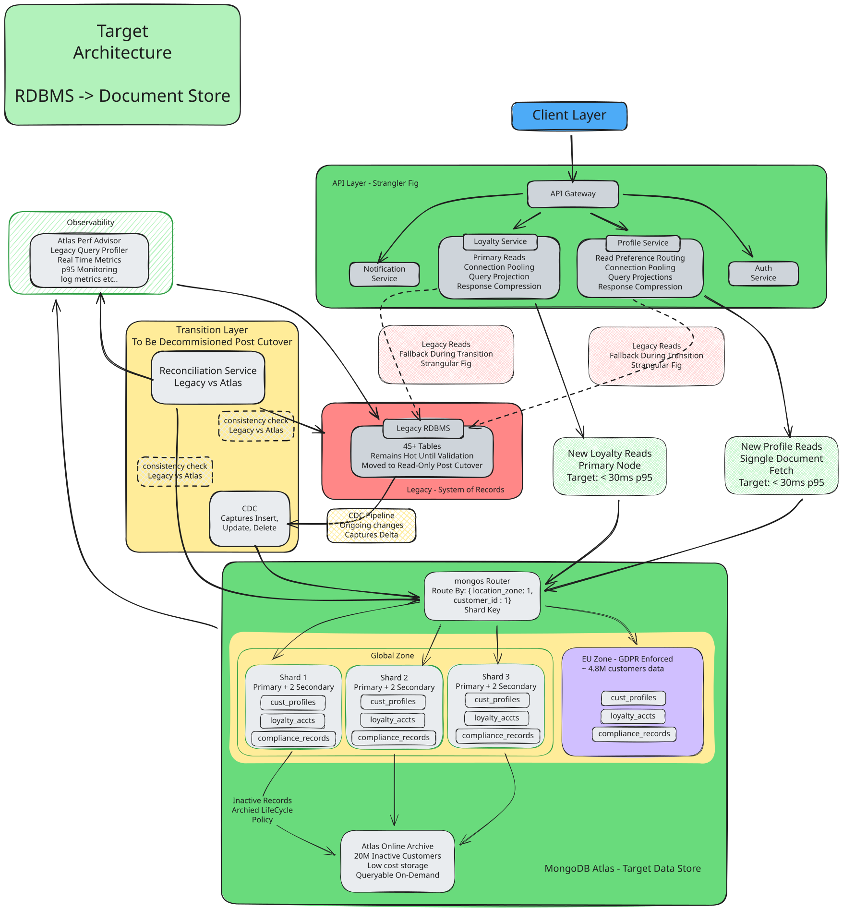

# Customer Profile & Loyalty Modernisation

>**Client:** Global Retailer  
**Engagement Type:** Legacy RDBMS → Document Model Migration  
**Status:** ```IN PROGRESS```  
**Last Updated:** [20 April 2026]


---

A global retailer's customer loyalty platform is built on 45+ normalised tables. What started as good relational design is now the single biggest blocker to shipping new features. This engagement modernises that foundation — without stopping
the business while we do it.

---


## Quick Reference — Delivery At a Glance


- Month 1  →  Discovery + schema design agreed  
  GDPR data residency strategy confirmed
  Sharding key selected for 32M records  

- Month 2  →  Core profile APIs live on new stack . 
  Dual-write pipeline running
  EU region infrastructure provisioned

- Month 3  →  Full data migrated and reconciled . 
  5% production traffic shifted . 
  p95 latency baseline validated against 30ms target . 

- Month 4  →  50% traffic shifted . 
  Performance validated at 2X normal load . 
  GDPR compliance audit completed . 

- Month 5  →  100% cutover
  **Loyalty points API live**     
  Peak season readiness validated at 5X load simulation . 

- Month 6  →  Team handover . 
  Legacy RDBMS decommission plan handed over
  Engagement closed


---

## Architecture Diagram

#### CURRENT STATE



#### TARGET STATE




---

> This is a working document. All recommendations are subject to refinement based on discovery findings and panel input.


---

